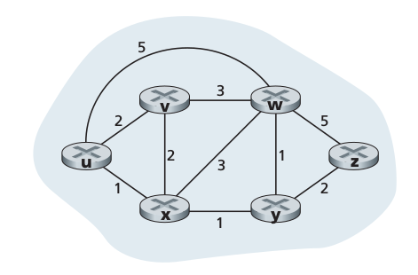

# NetWorkProject2
***

计算机网络大作业2

### 第一部分
两两直接连接的系统
** 注意 ** 到这是基于ip层的通讯

#### 分析
##### 路由表（router_Table）
该路由表记录其所在的网络的拓扑信息
如下格式
** 对称信息不是冗余的 **

```
	{‘u’： {‘u’：0，‘v’：2}，
	  ‘v’：{‘v’：0, ‘u’:2}}

```

##### Index和ip映射表（ip_Mapping）

```
	{‘u’:192.168.199.13,
	 'v': 192.168.199.12
	}
	
```

##### 路径图（path_Table）
路径表
最左边是起点，最右边是终点，中间是路径
也就是说发送的时候 **消息** 的时候先从路径图找到下一跳的信息，然后从路由表找到其对应的ip地址作为下一跳的地址

```
	[[a,b,c,d], [a,b,d,r,g]]	
	def xxxx():
	    global path_Table
	    path_Table[0][1]
```

##### 监听流程
该线程，接受到之后，进行判断
* 如果是Hello包就判断更新本地的路由表并且重新计算最短路径
* 如果是消息那么再判断
	* 如果自己是接受方，则显示 
	* 如果自己是中转，则查看最终的目的地，然后从路径图中找到最短路径的下一跳，再从路由表中找到对应下一条的ip
	
##### 消息包

```
	// 此处的message就是string类型
	s.sendto(message ,(ip,port))
	// 报文格式
	第一个字符（0表示不是Hello包，1是hello包，此处应该是0）： 1/0 
	（目的地的ip）：
		192.168.1.13
	 |
	第十九之后的均是正文

```

##### Hello包
Hello包的作用有两个
* 通知 **直接连接的节点** 我这个节点还活跃
* 发送自己的路由表
采用udp发送
格式

```
	// 此处的message就是string类型
	s.sendto(message ,(ip,port))
	// 报文格式，每一段之间的分割符是 '|'
	第一个字符（0表示不是Hello包，1是hello包，此处应该是1）： 1/0 
	第三个字符（路由条目和ip映射表，比如，同时需要包含自己的ip，注意了，我们一开始会为每台机器分配一个字符标致）：
		{‘u’： {‘u’：0，‘v’：2}，‘v’：{‘v’：0, ‘u’:2}}|{‘u’:192.168.199.13,'v': 192.168.199.12}
		
	global router_Table;
	global ip_Mapping;
	global myself;
	directNode = router_Table[myself]
	for ip in directNode.keys():
	 	// sendTo() ip_Mapping[ip]
		
```

##### 线程之间共享
使用线程类Threading
注意到 **路由表**  和 **ip映射表** 需要考虑到互斥问题，可参考参考资料1的链接中的RLock简单实现，拿得到数据就进行操作，拿不到就等

##### 流程
每台电脑维一开始维护一张直接相连接的路由器的图，启动之后，会向直接的路由器发送hello包，包含自己直接连接的条目，周期暂定为5秒，并且计算自己的最短路径
一段时间后网络收敛，若是有条目更新，便重新计算最短路径
消息转发
每一台路由都有整个网络的拓扑结构，发送消息都会选择最短路径上的下一跳

#### 分工
* 监听函数
	* 处理hello包：庄
	* 处理消息转发以及显示：欧
* hello包发送函数：罗干

#### 路由器的拓扑图


#### 实验机器ip对应
* U:192.168.199.69 pi
* V:192.168.199.138 Mac
* W:192.168.199.208 台式
* X:192.168.199.60 党员
* Y: 192.168.199.5 班长
* Z: 192.168.199.6 tp

#### 全局变量
```
HOST 主机ip
Port 协商好的端口
INF 一个极大值

```

#### 传输问题
dict -> json
json -> dict
才能成功实现字典和json的切换，因为dict转变为str之后，从str转为dict相当不方便

#### 依赖包
sudo apt install python3-tk

#### 分工
##### 写文档
欧光文

* send_message
* deal_With_Message_Packet
* 着重突出网络传输编码问题

罗干

* settings
* send_hello
* main

庄嘉鑫

* 着重突出python3 import问题
* Listening
* deal_With_Hello_Packet

#### 遇到的难点
##### 网络传输问题
**注意：这个项目使用的是python3语法**
python3默认使用utf-8编码，在处理数据的网络传输中非常方便

###### 发送数据包（dict对象）
1. 使用json.dumps将其序列化为json格式
2. 使用str.encode('utf-8')将其转换成bytes格式

###### 接受数据包（dict对象）
1. 使用str.decode('utf-8')将数据包从bytes转换成str类型
2. 使用json.loads将str数据转换成dict对象

##### python3 import问题

#### 文档
##### send_hello.py
function
* 输入：
* 输出：
* 功能：

##### send_message.py
function
* 输入：数据包内容和接受该数据包的目的节点
* 输出：无
* 功能：选择从发送节点到目的节点的最短路径（通过迪杰特斯拉算法生成），然后将该数据包发送给该路径中的下一个节点
* 实现原理：点击发送按钮时，会先判断数据包和目的节点是否合理。只有当两者都合理时，才根据迪杰特斯拉算法取得下一个节点，将该数据包发送到该节点

##### deal_With_Message_Packet.py
function
* 输入：数据包
* 输出：无
* 功能：进行数据包的处理。如果目的节点是自身，则将其进行输出；否则，进行数据包的转发


#### 进度
##### 12.12
除了网络节点瘫痪处理外基本实现
需要补充ospf的相关知识以及预订12.14晚上7点518 6台机器测试

### 贡献者
欧光文，庄嘉鑫，罗干

#### 参考资料
1. [RLock](https://harveyqing.gitbooks.io/python-read-and-write/content/python_advance/python_thread_sync.html)
2. [Threading例子](http://www.ourunix.org/post/206.html)
3. [__init__.py import](http://blog.sina.com.cn/s/blog_615c388d01017b5o.html)
4. [设置ftp匿名上传](http://www.cnblogs.com/cocoajin/p/3761414.html)