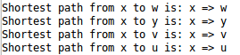
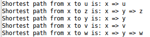
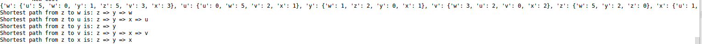
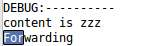
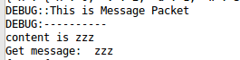
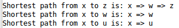
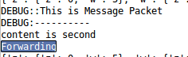
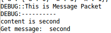

#计算机网络大作业2
***


### 第一部分：作业要求


### 第二部分：具体实现目标
目标：使用路由算法中的LS实现简单的拓扑结构下的路由
1. 交换路由信息
2. 形成最优传递路径
3. 传递消息
4. 当拓扑结构中某一台设备荡机之后可以动态更新拓扑图，然后形成最新路径
5. 使用dijstras算法实现最短路径

### 第三部分：具体实现
* 实现所在的网络通许层面：应用层和传输曾之间的，使用socket完成，传输曾使用udp
* 编程语言：python3
* 操作系统：Ubuntu16.04， macOS
* 编码：utf-8

#### 路由器拓扑图


#### 参与实验的主机的ip
* U:192.168.199.69 pi
* V:192.168.199.138 Mac
* W:192.168.199.208 台式
* X:192.168.199.60 党员
* Y: 192.168.199.5 班长
* Z: 192.168.199.6 tp

#### 分析
在下面的阐述中，我们把参与实验的每台机器（电脑）称为路由器
##### 1. 虚拟链路模拟
我们需要模拟链路的状态，也就是需要相应的办法识别出直连的节点与非直连的节点的差别
因而采用在每一台机器 **启动** 之前 **初始化** 一张该机器直接相连的路由表。表格实现如下

```
# 全局变量，记录某个节点直接相连的节点以及到该节点需要的cost
router_Table = {
    'z':{'w': 5, 'z': 0, 'y':2},  # z到w节点需要5代价，到z节点不需要代价，到y节点需要2代价
    'w':{'w': 0, 'z': 5},          # 以下两条是根据上面的路由信息写出来的，看似冗余，实则是在应用dijkstra计算的时候必不可少
    'y':{'y': 0, 'z': 2}
}
```
以上是Z节点的直接相连的信息
同时还会维护一张表格记录自己知道的路由器的ip地址

```
# 全局变量，记录某个节点知道的路由器的ip地址，方便发送信息的时候知道目标地址的ip
ip_Mapping = {
      'w': '192.168.199.208',
      'y': '192.168.199.5',
      'z': '192.168.199.6'
}
```

##### 2. 交换信息（hello包）
###### 发送方
直接相连接的路由器在启动指之初就维护一张路由表，在程序运行的时候会维护更新该表，因而我们设定了一种报文格式负责传递路由信息，我们称之为hello包，每隔5秒会向直接向直接相连的节点发送一次报文。报文有三个字段

1. "type"，值是字符串，“00“
2. "router_table" ，值是字典
3. "ip_Mapping"，值是字典

该信息在发送的时候需要先序列化，然后utf-8编码，收到的时候先utf-8解码然后反序列化

###### 接受方
接受方拆包之后根据type字段判断是hello包，然后根据router_table判断是否需要增添自己没有的条目，同理ip_Mapping，因而实现了路由信息传递的方法

##### 3. 传递消息
###### 发送方
传递消息也需要一种报文格式叫做message包，我们同样的定义了三个字段

1. ”type"， 值是字符串，"01"
2. ”goal_ip" 值是字符串，目标地址的ip
3. "content" 值是发送消息的内容

该信息在发送的时候需要先序列化，然后utf-8编码，收到的时候先utf-8解码然后反序列化

######接受方
接受方拆包之后根据type字段判断是message包，然后考虑若goal_ip是自己就在控制台上打印出来，否则按照从自己到达goal_ip的最低cost的路径把该message_packet原封不动转发给最低cost的下一条

##### 4. 当拓扑结构中某一台设备荡机之后可以动态更新拓扑图，然后形成最新路径
为了实现路由表的动态删除死亡节点，我们采用heartbeat包的方式
###### 发送方
heartbeat包只有一个字段
 type， 值是字符串，"11"
 每 **5秒** 向网络中的所有节点发送heartbeat包

###### 接受方
接受方拆包之后，判断是heartbeat包的情况下，在receiver中修改其条目为true表明该节点是存活的，receiver定义如下

```
# 全局变量，记录所在网络拓扑中除了自己之外的所有节点的存货情况
receiver = {
  'u': False,
  'v': False,
  'w': False,
  'x': False,
  'y': False
}
```
每隔 **30秒** 会运行一次对router_table执行删除不存活的节点的路由信息，具体操作如下，若下图是原本Z节点的路由信息，当w节点死亡（即不再发送heartbeat包）且超过了30s，则删除其相应的条目

```
router_Table = {
    'z':{'w': 5, 'z': 0, 'y':2},
    'w':{'w': 0, 'z': 5},
    'y':{'y': 0, 'z': 2}
}
```

删除后
```
router_Table = {
    'z':{'z': 0, 'y':2},
    'y':{'y': 0, 'z': 2}
}
```

##### 5. 使用dijstras算法实现最短路径
以上的所有步骤几乎是维护网络拓扑结构的完整，使得每台机器都能完整的获得最新的网络拓扑结构信息，同时能应对节点死亡的情况。而消息转发的时候的最短路径，我们采取每个节点都计算各自的dijstra算法，找到每个节点到剩余节点的最短路径。在本地使用path_Table变量（list）来维护这个信息

#### 代码目录结构


#### 细分难题

##### 线程之间共享
使用线程类Threading
注意到 **路由表**  和 **ipMapping** 这类需要考虑到互斥问题，可参考参考资料1的链接中的RLock简单实现锁住线程，拿得到数据就进行操作，拿不到就等

##### 传输问题
为方便传输dict类型的参数，传输方采用直接将对象序列化,utf-8编码，然后传输，接受方采用utf-8解码然后反序列化

##### 一些需要的全局变量
每个主机均需要注释相应部分的 router_Table，ip_Mapping，receiver

```
HOST # 主机的标记，比如'z'
Port   # 协商好的端口，该项目采用2711
INF    # 一个极大值，用于dijkstra计算
```

##### python3目录import问题
在写代码的时候我们希望将代码组织在有序文件夹下面，譬如说send_hello.py就放在src/package/Forwarding下面，那么处在/src下面的main.py函数为了能用到该方法，需要做两件事

1. package开始的文件夹均要加入__init__.py文件，用来帮助python编译识别包
2. import的时候使用绝对路径

第2点显著突出在，当我们在/settings.setting.py文件中定义了全局变量，当其他文件想使用的时候，务必直接import绝对路径才能真正读取修改该变量，血的教训！

虽然python简单，但是毕竟每门语言都其特性，不去集中时间了解，反而在大项目中往往会掉进各种蜜汁坑

#### 运行
#### 依赖包
> sudo apt install python3-tk // 用于窗口实现

#### 修改注释
在每台对应的电脑上修改相应局部注释，然后台路由器在30s内全部启动
#### 查看所有电脑的路由表信息
#### 查看所有电脑更新之后的路由信息
#### 查看路由收敛之后的最短路径
#### 发送消息
中间节点在控制台输出Forwarding，而最终节点会输出起始起始节点的消息
#### 荡机一台路由器，重复以上步骤

#### 分工
##### 写文档
欧光文
* send_message
* deal_With_Message_Packet
* timing
* 着重突出网络传输编码问题

罗干
* settings
* send_hello
* main

庄嘉鑫
* 着重突出python3 import问题
* Listening
* deal_With_Hello_Packet

#### 文档（介绍文件以及内部函数）
##### send_hello.py

messages_to_json

* 输入：标识位，路由表，IP映射表，记录是否收到心跳包的表。
* 输出：json对象
* 功能：将三个字段序列化

heartbeat_to_json

* 输入：包的标识位
* 输出：json对象
* 功能：将heartbeat包序列化

send_hello_heartbeat_single

* 输入：无
* 输出：无
* 功能：只向直接连接的节点发送hello包,heartbear包

send_hello_heartbeat

* 输入：无
* 输出：无
* 功能：每隔5秒向相邻节点发送hello和heartbeawt包。

##### deal_With_Hello_Packet.py

deal_With_Hello_Packet

* 输入：收到的hello包中包含的路由表和IP映射表
* 输出：无
* 功能：进行hello包的处理。将结点当前的路由表，IP映射表与收到的hello包中包含的路由表，IP映射表进行比对。如果收到的hello包中包含的路由表和IP映射表有自己没有包含的条目，则增加之，并运行dijkstra计算最短路径，更新到path_Table。

##### timing.py

timing

* 输入：无
* 输出：无
* 功能：删除多余的路由信息。

cycle

* 输入：无
* 输出：无
* 功能：每隔30s运行一次删除死亡节点的路由信息。

##### Listening.py

Listening

* 输入：无
* 输出：无
* 功能：监听并接收包，根据包头部type判断包的类型（hello, message, heartbeat三种类型），并根据包的类型调用相应的处理函数。

getName
* 输入：ip地址
* 输出：无
* 功能：获取ip地址对应的HOST。

##### dijkstra.py

generate_Shortest_Path

* 输入：无
* 输出：无
* 功能：应用dijstra算法生成最短路径并且更新到path_Table。

initiallizatoin_for_ls

* 输入： 节点自己的标记u， 网络拓扑G
* 输出： 节点u到所有节点的代价， 当前的所有与u直接相连的节点集合，与该节点直接相连的节点的前一个节点为u
* 功能：初始化

min_D_w

* 输入：当前起始节点到所有已知节点的代价D, 当前已经计算过代价的节点集合
* 输出：最小的
* 功能：计算最短路径。

shortest_Path

* 输入：起始节点u，目标节点，每一个节点的前一个节点的集合
* 输出：从u到end的最短路径
* 功能：根据已经生成的path_Table找到从u到end的最短路径

Link_State_Agorithm

* 输入：u是起始节点，G是网络拓扑
* 输出：D是起始节点到左右节点的代价，pre记录所有节点在最短路径的树中的父节点
* 功能：生成最短路径

##### settings.py

* 输入：无
* 输出：无
* 功能：配置文件，存储每个结点的路由表和IP映射表。

##### send_message.py
function
* 输入：数据包内容和接受该数据包的目的节点
* 输出：无
* 功能：选择从发送节点到目的节点的最短路径（通过迪杰特斯拉算法生成），然后将该数据包发送给该路径中的下一个节点
* 实现原理：点击发送按钮时，会先判断数据包和目的节点是否合理。只有当两者都合理时，才根据迪杰特斯拉算法取得下一个节点，将该数据包发送到该节点

##### deal_With_Message_Packet.py

deal_With_Message_Packet

* 输入：数据包
* 输出：无
* 功能：进行数据包的处理。如果目的节点是自身，则将其进行输出；否则，进行数据包的转发


#### 测试结果截图
##### 测试路径
###### 正常情况下：x -> y -> z
路由信息稳定前：
x的路由信息：  


路由信息稳定后：  
x的路由信息：  

z的路由信息：  


发送信息：  
x发送信息（zzz）：  
y转发信息：  

z收到消息：  


y宕机后：x -> w -> z  
x的路由信息：  

发送信息：  
x发送信息(second):  
w转发信息：  

z转发信息：  


#### 进度
##### 12.12
除了网络节点瘫痪处理外基本实现
需要补充ospf的相关知识以及预订12.14晚上7点518 6台机器测试

##### 12.14
所目标功能实现

##### 12.16
README更新完毕

#### 12.19
进行最后的README更新，补充效果截图

### 贡献者
欧光文，庄嘉鑫，罗干

#### 参考资料
1. [RLock](https://harveyqing.gitbooks.io/python-read-and-write/content/python_advance/python_thread_sync.html)
2. [Threading例子](http://www.ourunix.org/post/206.html)
3. [__init__.py import](http://blog.sina.com.cn/s/blog_615c388d01017b5o.html)
4. [设置ftp匿名上传](http://www.cnblogs.com/cocoajin/p/3761414.html)